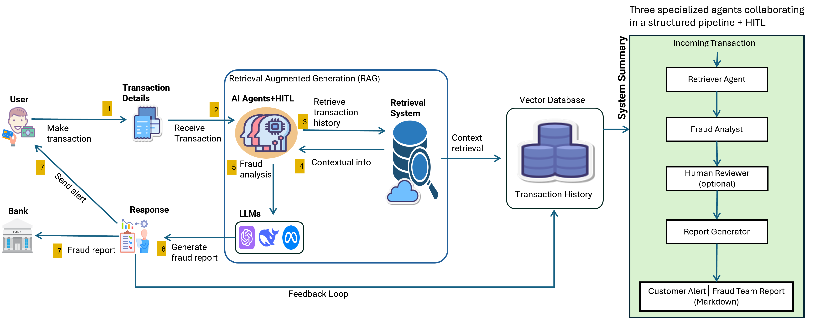
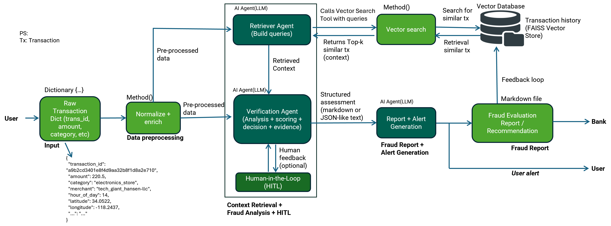

# Agentic AI Approach for Online Fraud Detection

[](https://opensource.org/licenses/MIT)
[](https://www.python.org/)
[](https://www.docker.com/)
[](https://www.crewai.com/)

## Table of Contents

- [Abstract](#abstract)
- [Introduction](#introduction)
- [Literature Review](#literature-review)
- [Methodology](#methodology)
- [Implementation](#implementation)
- [Evaluation](#evaluation)
- [Results](#results)
- [Conclusion](#conclusion)
- [Future Work](#future-work)
- [Installation](#installation)
- [Usage](#usage)
- [Architecture](#architecture)
- [Configuration](#configuration)
- [Testing](#testing)
- [Contributing](#contributing)
- [References](#references)
- [Acknowledgments](#acknowledgments)

### High-Level Architecture Diagram



## Abstract

This Master's thesis presents an innovative Agentic AI system for online credit-card fraud detection, leveraging a retrieval-augmented, multi-agent architecture. The system employs CrewAI for orchestration, semantic search via FAISS for contextual evidence retrieval, and Large Language Models (LLMs) for risk reasoning. An optional human-in-the-loop (HITL) mechanism enhances decision-making, producing audit-ready reports. Rigorous evaluation metrics including precision, recall, F1-score, AUC-PR, and latency analysis ensure system reliability. The implementation is containerized using Docker for reproducibility and can operate locally or in interactive modes.

## Introduction

Online credit-card fraud poses significant challenges to financial institutions and consumers, with losses exceeding billions annually. Traditional rule-based and machine learning approaches often lack interpretability and adaptability to evolving fraud patterns. This thesis introduces a novel Agentic AI framework that combines retrieval-augmented generation (RAG) with multi-agent systems and an optional Human-in-the-Loop to provide transparent, evidence-based fraud detection.

### Problem Statement

- Inadequate interpretability in black-box ML models hinders trust and regulatory compliance.
- Static rules fail to adapt to sophisticated, adaptive fraud tactics.
- Lack of contextual evidence in decision-making processes.

### Objectives

- Develop a retrieval-augmented multi-agent system for fraud detection.
- Ensure interpretability through evidence-based reasoning and audit trails.
- Achieve high accuracy with measurable performance metrics.
- Enable human oversight via HITL for critical decisions.

### Scope and Limitations

The system focuses on transaction-level fraud detection using historical data. It assumes access to transaction histories and LLM APIs. Limitations include dependency on data quality and API availability.

## Literature Review

Recent advancements in AI for fraud detection include:

- **Retrieval-Augmented Generation (RAG)**: Lewis et al. (2020) demonstrated RAG's effectiveness in knowledge-intensive tasks, providing a foundation for contextual fraud analysis.
- **Multi-Agent Systems**: Frameworks like CrewAI enable collaborative AI agents, improving decision-making in complex domains.
- **Credit Card Fraud Detection**: Studies by Carcillo et al. (2019) and Akca et al. (2023) highlight the need for unsupervised and supervised learning combinations, while Bonkoungou et al. (2024) explore ML techniques.
- **Industry Applications**: Mastercard's AI-driven systems (Business Insider, 2025) showcase real-world implementations.

This work builds on these foundations by integrating RAG with multi-agent orchestration for enhanced interpretability.

## Methodology

The methodology employs a design science research approach, focusing on artifact development and evaluation.

### Research Design

1. **Artifact Development**: Iterative prototyping of the Agentic AI system.
2. **Evaluation**: Quantitative metrics (precision, recall, F1, AUC-PR) and qualitative analysis (interpretability, usability).
3. **Validation**: Comparative analysis with baseline methods and expert reviews.

### Data Sources

- **Transaction Data**: Synthetic dataset (`customer_transaction_history.csv`) generated using the Sparkov Data Generation tool from [https://github.com/namebrandon/Sparkov_Data_Generation](https://github.com/namebrandon/Sparkov_Data_Generation). This tool creates realistic credit card transaction data with features like amount, category, location, and timestamps to simulate real-world scenarios for fraud detection research.
- **Ground Truth**: Labeled data for evaluation (`ground_truth1.json`).

### Ethical Considerations

- Data privacy: Use of synthetic data to avoid real user information exposure.
- Bias mitigation: Regular audits for algorithmic fairness.
- Transparency: Open-source implementation for community scrutiny.

## Implementation

### Technology Stack

- **Orchestration**: CrewAI for multi-agent coordination.
- **Retrieval**: LangChain + FAISS for vector-based semantic search.
- **LLM**: OpenAI API for reasoning and analysis.
- **Evaluation**: Scikit-learn, NumPy for metrics; Matplotlib, Seaborn for visualization.
- **Deployment**: Docker/Docker Compose for containerization.

### Repository Structure

```
.
├── agents/
│   ├── retriever_agent.py       # Semantic query crafting and retrieval
│   ├── fraud_analyst.py         # Fraud analysis and risk scoring
│   └── report_generator.py      # Report generation
├── tasks/
│   ├── retrieval_task.py        # Retrieval task definitions
│   ├── analysis_task.py         # Analysis task with HITL
│   └── report_task.py           # Reporting task
├── tools/
│   ├── vector_search_tool.py    # FAISS-based search implementation
├── data/
│   └── customer_transaction_history.csv  # Historical transactions
├── reports/
│   ├── all_results.json         # Predictions with latency
│   ├── fraud_report.md          # Generated reports
│   └── all_results_log.md       # Accumulated logs
├── evaluation/
│   ├── evaluator.py             # Metrics computation and visualization
│   ├── ground_truth1.json       # Ground truth labels
│   ├── evaluation_metrics.json  # Computed metrics
│   ├── evaluation_metrics.md    # Formatted report
│   ├── evaluation_confusion_matrix.png
│   └── evaluation_aucpr.png
├── transaction/
│   └── sample.py                # Test transaction
├── main.py                      # Pipeline orchestration
├── Dockerfile                   # Container configuration
├── docker-compose.yml           # Multi-service setup
├── requirements.txt             # Python dependencies
├── environment.yml              # Conda environment
└── README.md                    # This documentation
```

### Key Components

- **Retriever Agent**: Generates semantic queries and retrieves similar transactions.
- **Fraud Analyst Agent**: Performs risk assessment using contextual evidence.
- **Report Generator Agent**: Creates user alerts and detailed audit reports.
- **HITL Mechanism**: Allows human intervention for decision refinement.

## Evaluation

### Metrics

- **Classification Metrics**: Precision, Recall, F1-Score, Confusion Matrix.
- **Ranking Metric**: AUC-PR for imbalanced datasets.
- **Performance Metric**: Per-request latency analysis.

### Evaluation Pipeline

The `evaluation/evaluator.py` script computes metrics from confusion matrix inputs or prediction files. It generates JSON outputs, markdown reports, and visualizations.

### Example Usage

```bash
python evaluation/evaluator.py --manual-conf 32 1 3 64 --results reports/all_results.json --ground-truth evaluation/ground_truth1.json
# Where 32 1 3 64 represent TN FP FN TP (True Negatives, False Positives, False Negatives, True Positives)
```

## Results

### Performance Metrics

Based on evaluation runs:

- **Precision**: 0.9846
- **Recall**: 0.9552
- **F1-Score**: 0.9697
- **AUC-PR**: 0.9889
- **Latency**: Mean 50.40s, Median 48.84s

### Qualitative Analysis

- High interpretability through evidence-based reasoning.
- Effective HITL integration for complex cases.
- Reproducible results via containerization.

### Visualizations

- Confusion Matrix Heatmap: 
- Precision-Recall Curve: 

## Conclusion

This thesis demonstrates the efficacy of Agentic AI in fraud detection, achieving high accuracy while maintaining interpretability. The retrieval-augmented multi-agent approach addresses key limitations of traditional methods, providing a scalable framework for financial security.

### Contributions

- Novel integration of RAG with multi-agent systems for fraud detection.
- RAG-Grounded Financial Reasoning and Audit-Ready Explainability Artefacts.
- Comprehensive evaluation framework for AI-driven security systems.

## Future Work

- Hybrid Agentic–Machine Learning Pipelines.
- Integration with real-time streaming data.
- Robustness Under Concept Drift and Adversarial Behaviour.
- Multi-modal analysis incorporating user behavior patterns.
- Deployment on cloud platforms for scalability.

## Installation

### Prerequisites

- Python 3.10+
- Docker and Docker Compose (for containerized runs)
- OpenAI API Key

### Local Installation

```bash
pip install -r requirements.txt
# or
conda env create -f environment.yml
conda activate fraud-det
```

### Docker Setup

```bash
docker-compose build
```

## Usage

### Quick Start

1. Set OpenAI API Key in `.env`:
   ```
   OPENAI_API_KEY=your_real_key_here
   ```

2. Run locally:
   ```bash
   python main.py
   ```

3. Run with Docker (interactive):
   ```bash
   docker-compose run --rm --service-ports -it fraud_detection_ai python main.py
   ```

### Workflow

1. Prepare data in `data/customer_transaction_history.csv`.
2. Execute pipeline via `main.py`.
3. Review outputs in `reports/` directory.
4. Evaluate using `evaluation/evaluator.py`.

## Architecture

### Low-Level Diagram



### Data Flow

Client → Ingest → Retrieval → Analysis → HITL (optional) → Reporting → Evaluation

## Configuration

Key settings in `config/settings.py`:

```python
CSV_PATH = "data/customer_transaction_history.csv"
CHUNK_SIZE = 500
CHUNK_OVERLAP = 50
```

Environment variables:
- `OPENAI_API_KEY`: Required for LLM access
- `HITL_MODE`: Set to `false` to disable human input

## Testing

Use the predefined sample transaction in `transaction/sample.py`:

```python
sample_transaction = {
    "transaction_id": "b40c083614de1a1c8c8835d4bb01b380",
    "amount": 60.00,
    "category": "gas_transport",
    "location": (35.5494, -80.4226),
    "merchant": "Raynor Feest and Miller",
    "timestamp": "2025-04-15T15:47:12Z",
    "user_id": "4065133387262473",
    "merch_lat": 35.219240,
    "merch_long": -80.402563,
    "trans_time": "15:47:12"
}
```

Run test:
```bash
python main.py
```

## Contributing

1. Fork the repository.
2. Create a feature branch (`git checkout -b feature/branch-name`).
3. Commit changes (`git commit -m "feat: description"`).
4. Push to branch (`git push origin feature/branch-name`).
5. Open a Pull Request.

## References

1. Lewis, P., et al. (2020). Retrieval-Augmented Generation for Knowledge-Intensive NLP Tasks. *arXiv:2005.11401*. [https://arxiv.org/abs/2005.11401](https://arxiv.org/abs/2005.11401)
2. Carcillo, F., et al. (2019). Combining Unsupervised and Supervised Learning in Credit Card Fraud Detection. *Information Fusion, 49*, 59-71. [https://doi.org/10.1016/j.inffus.2018.12.005](https://doi.org/10.1016/j.inffus.2018.12.005)
3. Akca, Z., et al. (2023). A Systematic Review of Intelligent Systems and Analytic Applications in Credit Card Fraud Detection. *Applied Sciences, 15*(3), 1356. [https://doi.org/10.3390/app15031356](https://doi.org/10.3390/app15031356)
4. Bonkoungou, D., et al. (2024). Credit Card Fraud Detection Using ML Techniques. In *Artificial Intelligence for Data Science in Theory and Practice* (pp. 15-28). Springer. [https://doi.org/10.1007/978-981-99-9811-1_2](https://doi.org/10.1007/978-981-99-9811-1_2)
5. Business Insider. (2023). Mastercard's AI-Powered Fraud Detection System. [https://www.businessinsider.com/mastercard-ai-fraud-detection-2023](https://www.businessinsider.com/mastercard-ai-fraud-detection-2023)

## Acknowledgments

I would like to express my sincere gratitude to my supervisors:

🧑‍🏫 Prof. Dr. Dr. h.c. Wolfram Hardt — Chair of Computer Engineering, TU Chemnitz

🧑‍💼 Dr. Shadi Saleh — for his direct supervision, guidance, and extensive support throughout the project.

Your mentorship has significantly shaped my growth as a researcher and engineer.  

Special thanks to the open-source community for providing the foundational tools and libraries used in this project. 

